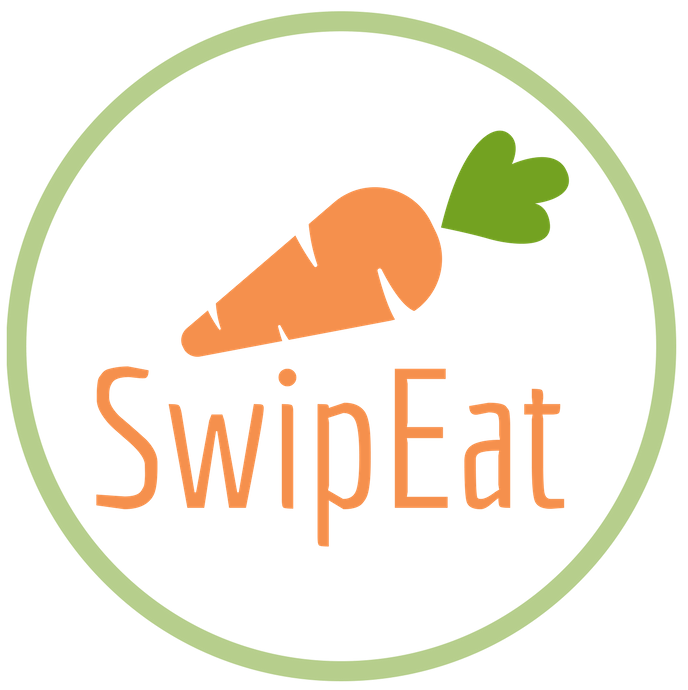

 
 
 
 
 
 
 
 
 

# SwipEat - Groceries made easy!

Swipeat will make it easy to plan your meals and shop for groceries.

## What is Swipeat ?

An application to help you plan meals according to your preferences, and then create the corresponding shopping list.

- Ad lifestyle characteristics
- Choose the meals of your choice or swipe it
- Shopping list automatic created, editing always possible
- Chosen meals are saved and can easily be found when you will cook it

## Advantages for the users

1. Time saving
  - No more need to search for recipes, calculate how many ingredients needed and write down the list.
2. Easy way to discover new food and recipes
  - Choose in lifestyle characteristic specific food specialties
3. Easy to plan meals for the week
  - Thanks to lifestyle characteristic and the history of choices, Swipeat propose to the user a lot of recipes.
  - Choose or swipe the recipe
4. Easy to manage health constraint
  - Health constraint are in the lifestyle characteristic added
5. Recipe is quickly available at the moment of cooking
6. Shopping list can be editing before, during, after the shopping
  - As soon as something is physically ad on the shopping card, it&#39;s easy to remove the ingredient of the shopping list
7.  Shopping list is automatically listing in groups of food: vegetables together, milk products together, etc.
8. The amount of needed ingredients is automatically calculate depend on the number of person you give for a meal

## The typically user of Swipeat

- People who don&#39;t have time to plan their meals and write down their shopping list
- People who need some culinary imagination
- People who are curious to discover new culinary specialties
- People who want to make it easy to manage their health constraints
- People who are always connected with their smartphone

## Public Target

- People who do food shopping and who possesses a smartphone

## Opensource database

Swipeat is using open recipe data base that allow to build a huge choice of recipes

## Development possibilities

- Geo localization of shops
- Actions proposed on a specific product in a specific shop
- Data base can grow by people who propose new recipes
- Characteristic on a recipe can be ad by all users (that allow for instance to classify a recipe as &quot;sport&quot;)
- Thanks to the big data of consumption habits, SwipEat propose all the time better choices in the selection of recipes that appears to the user
- Nutritionist can classify a recipe as &quot;good&quot; for some type of illness
- Online shopping can be done directly with the shopping list thanks to a online shopping partner (ie. le shop)
- Shops can create recipe with their products in order to attire the user of SwipEat in their shop
- Producer can become a provider of recipes and so it allows him to attire specific people in his farm for direct sales or for online sales. (thank&#39;s to geo localization only user around receive this information)
- Ad ingredients on the shopping list and find a &quot;match&quot; for a recipe.
- Commercial recipes provider provide their recipe data base and can earn more visibility en placing their recipe
